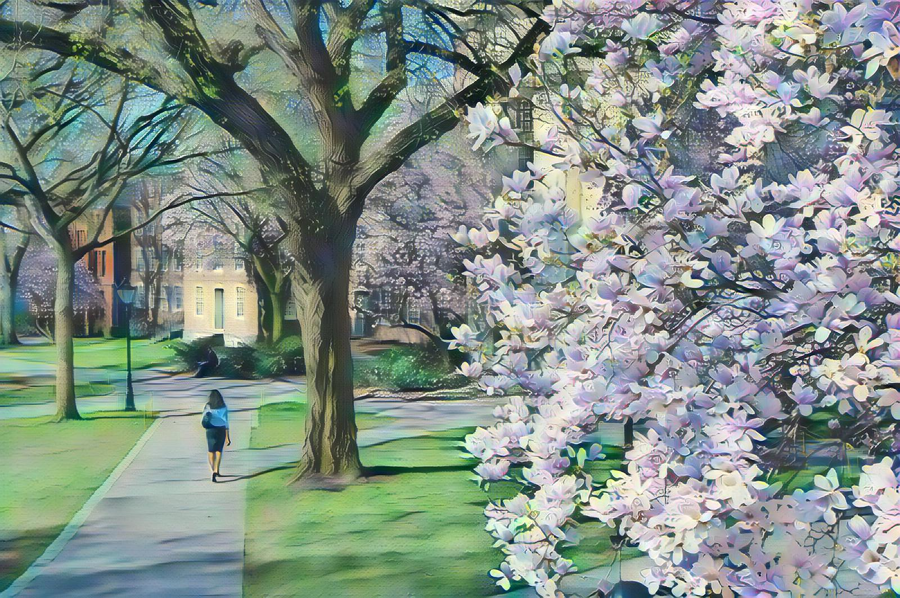

# Repo for implementation of AdaIN in tensorflow-2.0

We have implememted the AdaIN model described in [Arbitrary Style Transfer in Real-time with Adaptive Instance Normalization](https://arxiv.org/abs/1703.06868) using Tensorflow 2.0 version.

Required environments
* python 3.7.9
* tensorflow-gpu 2.4
* scikit-image 0.18.1
* [kaggle-api](https://github.com/Kaggle/kaggle-api): to download dataset from kaggle

The `requirements.txt` contains all packages in our virtual environment when implementing this model.

## Results
Below we presented several examples created by the AdaIN model implemented. The orginal content image is a picture taken in Brown University Main Green. For more examples, please check `./examples/results` folder.

|Styles| Results|
| ---- | ------ |
||| 
| ||
| ||

## Download data 
The training content images are [MS-COCO](https://cocodataset.org/#home) and style images are [WikiArt](https://www.kaggle.com/c/painter-by-numbers). We also provide the preprocessed dataset used in our training. The preprocess includes removing all images that don't have the third dimension, images whose third dimension number is not 3 and images that are too large to raise a warning. All images have been resized to the size of which the shortest dimension is 512. The image ratio is kept during the resizing. Check the `clean_images()` function in `preprocess.py` for details.

We provide the cleaned MS-COCO and cleaned WikiArt dataset on google drive. [[Click here](https://drive.google.com/drive/folders/1ifTga2jPIISksZljsg8HYHo9WvVfbwYW?usp=sharing)] We also provide download instruction in the `setup.sh`. In total, there are 82606 images in cleaned content folder and 78572 images in cleaned style folder.

## Usage
Use `python run.py --help` to check all available arguments. All hyperparameters are included in `hyperparameters.py`.

## Train
``` python
python run.py --content-dir ./images/content_cleaned \ 
              --style-dir ./images/style_kaggle_cleaned \ 
              --pretrained-vgg19 ./images/vgg19_normalised.npz
```

## Test
``` python
python run.py --load-checkpoint ./output/checkpoints/041921-213116/epoch1_batch_4000 \
              --evaluate \
              --content-evaluate ./examples/content/brownspring.jpg \
              --style-evaluate ./examples/style/starry_night.jpg
```

## Reference
1. Repository from Xun Huang, [AdaIN-style](https://github.com/xunhuang1995/AdaIN-style) implemented in Torch, who is the first author of AdaIN model paper
2. [AdaIN-style-transfer---Tensorflow-2.0](https://github.com/rasmushr97/AdaIN-style-transfer---Tensorflow-2.0), implemented in Tensorflow 2.0. (Note: The repo resize all images to (256, 256) without preserving the ratio, which is different from the data preparation described in the paper. It would cause wave pattern in the result.)
3. [Tensorflow-Style-Transfer-with-Adain](https://github.com/JunbinWang/Tensorflow-Style-Transfer-with-Adain), implemented in Tensorflow 1.0 version.